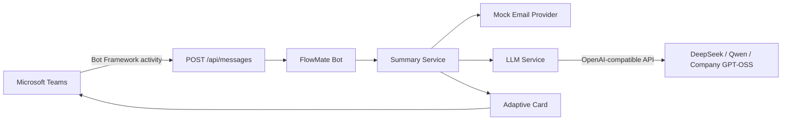

# FlowMate AI Prototype

FlowMate 是一个无 Web 页面、直接接入 Microsoft Teams 的企业 AI Bot 原型。用户在 Teams 中发送 `summarize my emails`，Bot 读取 Mock 邮件，通过 OpenAI-compatible 模型 API 生成结构化摘要，并返回 Adaptive Card。个人电脑可使用 DeepSeek 或阿里云百炼 Qwen 的官方 API Key，公司实验时再切换到内部 GPT-OSS-120B。

> 技术边界：这是 Leader Demo，不包含真实 Outlook、RAG、Memory、多 Agent、权限中心或 Workflow Engine。邮件 Provider 已抽象，后续可替换为 Microsoft Graph。

## 架构



服务端入口：

- `POST /api/messages`：Azure Bot 的真实 Messaging Endpoint，包含 Bot Framework JWT 验证。
- `POST /api/teams/message`：不经过 Teams 身份验证的本地链路测试接口。
- `POST /api/email/summary`：直接测试邮件摘要。
- `GET /health`：检查服务配置状态。
- 不包含前端页面。

## 1. 本地启动

### 一键启动

Windows（允许在宿主机运行，双击或在 CMD/PowerShell 中执行）：

```powershell
.\start-windows.cmd
```

选择 DeepSeek 或 Qwen 官方 API：

```powershell
.\start-windows.cmd -Provider DeepSeek
.\start-windows.cmd -Provider Qwen
```

脚本会检查 Python 3.11+、创建 `.venv`、安装依赖、生成 `.env` 并启动 FastAPI。第一次选择云模型后，脚本会要求先在 `.env` 中填写 API Key。运行宿主机测试：

```powershell
.\start-windows.cmd Test
```

Linux（服务和依赖只在容器中运行）：

```bash
chmod +x start-linux.sh
./start-linux.sh deepseek
# 或：./start-linux.sh qwen
```

其他 Linux 命令：

```bash
./start-linux.sh detached deepseek  # 后台启动
./start-linux.sh test deepseek      # 容器内测试
./start-linux.sh logs      # 查看日志
./start-linux.sh down      # 停止并删除容器
```

Linux 首次运行会根据 profile 从 `.env.deepseek.example`、`.env.qwen.example` 或 `.env.example` 生成 `.env`。填写 API Key 后再次执行相同命令。已有 `.env` 时不会覆盖；切换 provider 前请备份并删除旧 `.env`。

### 手动启动

Python 3.11+：

```bash
python -m venv .venv
source .venv/bin/activate
pip install -r requirements.txt
cp .env.example .env
uvicorn backend.main:app --host 0.0.0.0 --port 8000 --reload
```

或使用 Docker：

```bash
cp .env.example .env
docker compose up --build
```

验证：

```bash
curl http://localhost:8000/health
curl -X POST http://localhost:8000/api/teams/message \
  -H 'Content-Type: application/json' \
  -d '{"text":"summarize my emails"}'
```

## 2. 接入 DeepSeek / Qwen 官方 API

### DeepSeek

1. 在 DeepSeek 开放平台创建 API Key 并充值。
2. 生成配置：

```powershell
# Windows
.\start-windows.cmd -Provider DeepSeek
```

```bash
# Linux
./start-linux.sh deepseek
```

3. 编辑 `.env`：

```dotenv
LLM_PROVIDER=deepseek
LLM_BASE_URL=https://api.deepseek.com
LLM_API_KEY=sk-your-key
LLM_MODEL=deepseek-v4-flash
LLM_TRUST_ENV_PROXY=true
```

`deepseek-v4-flash` 支持 JSON Output，适合低延迟摘要。旧的 `deepseek-chat` 和 `deepseek-reasoner` 将于 2026-07-24 下线，因此模板直接使用 V4 模型名。

### 阿里云百炼 Qwen

1. 在阿里云百炼开通模型服务并创建 API Key。API Key 与地域绑定。
2. 生成配置：

```powershell
# Windows
.\start-windows.cmd -Provider Qwen
```

```bash
# Linux
./start-linux.sh qwen
```

3. 编辑 `.env`：

```dotenv
LLM_PROVIDER=qwen
LLM_BASE_URL=https://dashscope.aliyuncs.com/compatible-mode/v1
LLM_API_KEY=sk-your-dashscope-key
LLM_MODEL=qwen-plus
LLM_TRUST_ENV_PROXY=true
```

模板使用北京地域公网 endpoint。若 API Key 属于新加坡或独立 Workspace，请按百炼控制台提供的 OpenAI-compatible endpoint 修改 `LLM_BASE_URL`。

### 公司 GPT-OSS-120B

公司实验时使用默认 profile：

```dotenv
LLM_PROVIDER=company
LLM_BASE_URL=http://company-llm-api/v1
LLM_API_KEY=
LLM_MODEL=gpt-oss-120b
LLM_TRUST_ENV_PROXY=false
```

所有 provider 都通过同一 OpenAI-compatible Chat Completions Client 调用。请求包含 `model`、`messages`、`temperature`、`max_tokens` 和 `response_format: {"type":"json_object"}`，返回格式为：

```json
{
  "choices": [
    {
      "message": {
        "content": "{\"important\":[],\"normal\":[]}"
      }
    }
  ]
}
```

注意：

- 不要提交 `.env`；它已加入 `.gitignore`，模板中不包含真实 Key。
- DeepSeek/Qwen 的 `LLM_API_KEY` 会作为 `Authorization: Bearer ...` 发送。
- 云 API 使用企业代理时保持 `LLM_TRUST_ENV_PROXY=true`；直连内网模型时设为 `false`，避免 `HTTP_PROXY` 截获请求。
- 默认 `ALLOW_DEMO_FALLBACK=false`。模型连接或 JSON 格式失败时，Teams 会明确提示失败，不会把本地假摘要冒充模型输出。
- 若模型后端不支持 `response_format`，删除 [backend/services/llm_service.py](backend/services/llm_service.py) 中该字段；Prompt 仍要求输出 JSON。
- `401` 通常表示 API Key 错误，`402` 表示余额不足，`429` 表示达到限流。

先绕过 Teams 单独验证模型闭环：

```bash
curl -X POST http://localhost:8000/api/email/summary
```

成功响应中的 `generated_by` 会明确显示 `deepseek/deepseek-v4-flash`、`qwen/qwen-plus` 或 `company/gpt-oss-120b`。

官方参考：[DeepSeek API 与模型](https://api-docs.deepseek.com/quick_start/pricing)、[DeepSeek JSON Output](https://api-docs.deepseek.com/guides/json_mode/)、[Qwen OpenAI-compatible 调用](https://help.aliyun.com/en/model-studio/first-api-call-to-qwen)。

## 3. 创建 Azure Bot 和 Entra 应用

1. 在 Azure Portal 创建或选择 Microsoft Entra App Registration。
2. 记录 Application (client) ID 和 Directory (tenant) ID。
3. 创建 Client Secret，并立即保存 secret **Value**。
4. 创建 Azure Bot 资源，Microsoft App ID 使用上面的 client ID。
5. 在 Azure Bot 的 Configuration 中设置 Messaging endpoint：

   ```text
   https://YOUR_PUBLIC_HOST/api/messages
   ```

6. 在 Azure Bot 的 Channels 中添加 Microsoft Teams channel。
7. 配置服务端 `.env`：

   ```dotenv
   MICROSOFT_APP_ID=<Application client ID>
   MICROSOFT_APP_PASSWORD=<Client secret Value>
   MICROSOFT_APP_TENANT_ID=<Directory tenant ID>
   ```

`/api/messages` 必须能被 Azure 公网 HTTPS 访问。本地演示可使用 Dev Tunnel、ngrok 或公司反向代理，把公网地址转发到 `localhost:8000`。不要把 `/api/teams/message` 配成 Azure Messaging Endpoint，它不执行 Bot Framework 身份验证。

## 4. 打包并上传 Teams 应用

模板位于 `teams_app/manifest.json`，图标已经按 Teams 要求生成：`color.png` 为 192×192，`outline.png` 为 32×32。

1. 将 manifest 中所有 `${MICROSOFT_APP_ID}` 替换为 Entra Application ID。
2. 将 `YOUR_PUBLIC_HOST` 替换为不带协议和路径的公网域名；`websiteUrl`、`privacyUrl`、`termsOfUseUrl` 仍需保留 `https://`。
3. 只把以下三个文件放在 zip 根目录：

   ```text
   manifest.json
   color.png
   outline.png
   ```

4. 在 Teams 管理中心允许自定义应用；然后在 Teams 的 Apps → Manage your apps → Upload an app 上传 zip。
5. 安装 FlowMate，发送 `summarize my emails`。在群聊/频道中可使用 `@FlowMate summarize my emails`。

Linux/macOS 打包示例：

```bash
mkdir -p dist/teams-app
sed \
  -e 's/${MICROSOFT_APP_ID}/YOUR_APP_ID/g' \
  -e 's/YOUR_PUBLIC_HOST/bot.example.com/g' \
  teams_app/manifest.json > dist/teams-app/manifest.json
cp teams_app/color.png teams_app/outline.png dist/teams-app/
(cd dist/teams-app && zip -r ../flowmate-teams.zip manifest.json color.png outline.png)
```

如果组织禁止 sideload，需要由 Teams 管理员上传并批准该应用。

## 5. Demo 流程与排错

演示路径：Teams 消息 → Azure Bot channel → `/api/messages` → Mock emails → DeepSeek/Qwen/GPT-OSS → Adaptive Card。

常见问题：

- Teams 无响应：检查 Azure Bot 的 Messaging Endpoint 是否为公网 HTTPS，以及 Teams channel 是否启用。
- 返回 401：确认 App ID、secret Value、tenant ID 一致；不要填 secret ID。
- Bot 能回复但模型失败：从服务运行环境访问 `${LLM_BASE_URL}`，并用 `/api/email/summary` 隔离测试。
- 云模型 401/402：检查 Key、Key 所属地域、账号余额和 endpoint；不要把 DeepSeek Key 用于 Qwen endpoint，反之亦然。
- 模型返回 422：该 OpenAI-compatible 服务可能不支持 `response_format`，按上文移除该字段。
- Adaptive Card 不显示：保持 card version 为 1.4，并检查服务日志中的模型 JSON 校验错误。

## 6. SDK 生命周期说明

本 Prototype 按原始范围使用 Bot Framework SDK v4，以最小改动配合 FastAPI 和现有 Azure Bot channel。Microsoft 已将 Bot Framework SDK 归档，并从 2025-12-31 起停止支持工单；长期项目应迁移到 Microsoft 365 Agents SDK。Azure Bot 注册可继续复用，主要配置映射如下：

```text
MICROSOFT_APP_ID        → CONNECTIONS__SERVICE_CONNECTION__SETTINGS__CLIENTID
MICROSOFT_APP_PASSWORD  → CONNECTIONS__SERVICE_CONNECTION__SETTINGS__CLIENTSECRET
MICROSOFT_APP_TENANT_ID → CONNECTIONS__SERVICE_CONNECTION__SETTINGS__TENANTID
```

迁移时将 `BotFrameworkAdapter` 换为 `CloudAdapter`，并使用 `microsoft-agents-hosting-teams`。当前业务层 `SummaryService`、`LLMService` 和 Adaptive Card builder 与 Adapter 解耦，可直接保留。

官方参考：[Bot Framework SDK 状态](https://learn.microsoft.com/en-us/azure/bot-service/bot-service-overview?view=azure-bot-service-4.0)、[Python 迁移到 Microsoft 365 Agents SDK](https://learn.microsoft.com/en-us/microsoft-365/agents-sdk/bf-migration-python)。

## 7. 后续扩展

```text
MockEmailProvider       → MicrosoftGraphEmailProvider
BotFrameworkAdapter     → Microsoft 365 Agents SDK CloudAdapter
Simple SummaryService   → Agent Runtime / Skill Engine
Static email source     → delegated identity + authorization broker
```

这些扩展不属于当前 Demo。
